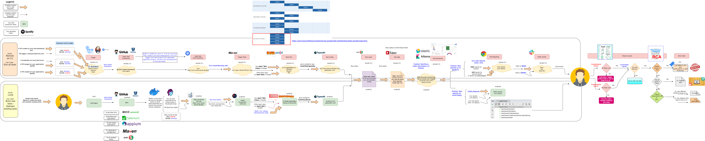

# Zero
Zero is our feature rich, core test automation framework, that can be used as an underlying automation framework
for any/and all kind of test automation frameworks (such as API, Browser, Mobile App).

## Working principles
- [ ] **Problem solving based learning** (Learn something when a problem comes. This way, you will remember it better).      
- [ ] **First make it work, then make it better** (Specially when working with new tools or tech, dont worry about getting it right the first time. First focus on making it work, then refactor to make it better)  

## Test goals and objectives
A good guideline to test any project is:

>> Test the right things, in the right order, at the right time.

- [ ] **Risk based testing** (Test the right things and avoid testing 3rd party/low risk software).  
- [ ] **Follow test pyramid** (in the right order)   
- [ ] **Fail fast, fail early** (at the right time)  
- [ ] **Prevent breaking changes from merging** (Run fast and stable API tests as a part of application pull requests). 
- [ ] **If cannot prevent, test immediately on merge** Run slower and flaky Mobile/Browser tests immediately on merge of pull requests on new deployed env. 
- [ ] **Test asap, if cannot test on merge** Use your creative imagination to do exploratory tests, UX testing post merge.  

## Test framework goals and objectives
Some of the key goas and objectives of our test framework are:  
- [ ] **Easy to understand** (Seperate test intentions from implementation)  
- [ ] **Easy to maintain** (Separation of concerns between data, config, code and tests)     
- [ ] **Easy to scale** (Prefer composition over inheritance. Follow SOLID principles)   
- [ ] **Fast execution time** (Create atomic, independent tests that can run in parallel to cut down on execution times)     
- [ ] **Test at right moment** (Have various CI workflows that allow testing as soon as possible)    
- [ ] **Reliable, robust tests** (Create generic classes that have methods that wait for the right state before acting on elements)  
- [ ] **Flexible tests that can run on any test env** (Move all env related information to its own config files, so that tests can flexibly run on any test environment) 

## Important files
There are some standard files, there deserves a section of their own. These are:    
- [x] **README.md file** (This is where you tell what your project is all about and how others can use it.)  
- [ ] **junit-platform.properties file** (This is where you specify your projects execution mode i.e. serial, or any of the available parallel execution modes)  
- [ ] **.log4j properties file**. (This specifies the log level for your project)    
- [ ] **application.conf and other conf file**. (This is where we specify common application config and config for each test environment)    
- [x] **.gitignore file**. (This contains everything that you are *not* interested in version controlling.)  
- [ ] **.gitattributes file**. (This is where you specify attributes of any files that are being version controlled.)    
- [ ] **.editorconfig file**. (This provides a way to have a common formatting rules within your team. In absence of this, your PRs would be a mess to review.)  
- [ ] **pom.xml file**. (This is where you define all your maven project dependencies.)  
- [ ] **LICENSE file**. (This is where you give permission to others to make use of your open source project.)   
- [ ] **Dockerfile**. (This is where you automate your test environment. i.e. all the parts that your project depends on; such as having a machine, JDK, Maven, setting up system environments, any other tools, etc all.)   
- [ ] **.dockerignore file**. (Like gitignore file, here we specify everything that we want to be ignored from passing to docker build context.)     
- [ ] **docker-compose.yml file**. (A convenient way to set up a local instance of your dockerized application on your localhost machine. )  

## Toolset
Key tools to be used in this core framework are:    
- [ ] **Java** (As the core programming language)    
- [ ] **Maven** (for automatic dependency management)    
- [ ] **Junit 5** (for assertions)   
- [ ] **Slf4J/Log4J** (for logging interface and as a logging library)   
- [ ] **Typesafe** (for application configuration for multiple test environments)    
- [ ] **Surefire** (for xml reports in CI)   
- [ ] **Surefire Site plugin** (for html reports in CI)  
- [x] **Github** (for version control)   
- [ ] **Github actions** (for continuous integration)    
- [ ] **Faker library** (for generating random test data for different locales - germany, france, netherlands, english)  
- [ ] **Slack integration** (for giving notifications on pull requests)   
- [ ] **Elastic and Kibana** (for test monitoring)   
- [ ] **Docker** (for automating test framework's environment)   
- [ ] **Powershell or bash Script** (for automating building test environment)   
- [ ] **SonarQube/SonarLint** (for keeping your code clean and safe)     
- [ ] **Badges** (for a quick view on your project meta and build status)    

Key tools that we will use in other frameworks, that will all extend this core framework are:   
- [ ] **RestAssured**  (library for Rest API automation)     
- [ ] **Selenium**  (library for Browser automation)     
- [ ] **Appium**  (library for Mobile ios/android automation)    

## end to end test automation process

## References
- [README-wiki](https://en.wikipedia.org/wiki/README)
- [how-to-write-a-good-readme-file](https://www.freecodecamp.org/news/how-to-write-a-good-readme-file/)
- [another-good-readme-example](https://github.com/othneildrew/Best-README-Template)
- [java-gitignore-file-example](https://gist.github.com/dedunumax/54e82214715e35439227)
