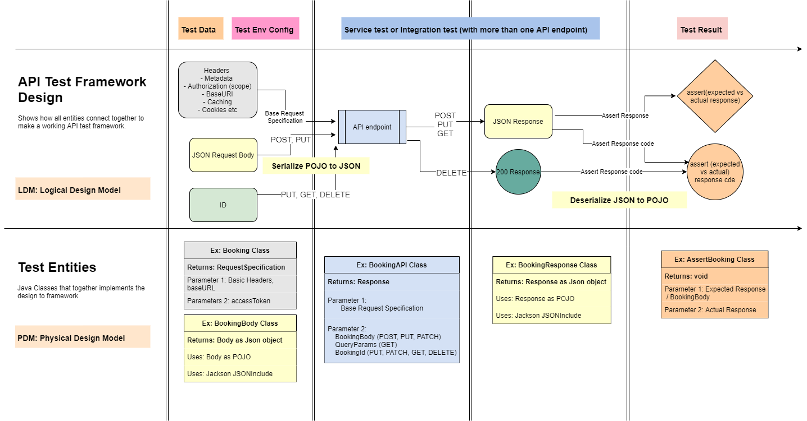

# 🦾 restpro

Test RestAPIS like a PRO.

> NOTE: If you see errors while running the project, make sure that you have
> completed the getting started steps from below section (especially decrypting
> encrypted config files using `git-crypt`.

### 🔢 Requiring (one time) manual setup by user

1. [**JDK 11**](https://www.oracle.com/java/technologies/javase/jdk11-archive-downloads.html) - as language of choice
   for writing this test framework.
2. [**Maven 3.8.6+**](https://maven.apache.org/) - for project dependency management and running tests in CI.
3. [**git-crypt**](docs/README-GIT-CRYPT.md) - to encrypt/decrypt secret files.
4. [**pre-commit**](docs/README-CODE-FORMATTING.md) - To have code automatically and uniformly formatted (JAVA, JSON,
   XML, YAML).

## 🚀 Core features

- [x] Allow to put both exploratory tests (postman style http requests) and automated tests (RestAssured) side-by-side
  in the same framework. Usually due to Postman not being git compatible, these two tests live in two separate
  places/repositories.
- [x] Shows how to create a decoupled test design (that minimises maintenance efforts by reducing code
  duplication and increases code readability by separating test intentions from implementation details).
- [x] Allows users to write fluent assertions for asserting both status and response body, without any code duplication.
- [ ] Creates APIs that are scope/role agnostic. This allows you to use the same APIs and data to write tests for
  different user roles and scopes.
- [ ] Shows how to reuse the same auth token in all the tests for same role/scope using a Singleton pattern.
- [ ] Shows how to provide different token types for different role/scopes using a TokenFactory pattern.
- [ ] Shows how to use health checks in the test CI to have efficient pipelines.
- [ ] Shows how to insert test data dynamically in each test.

> A Note on Postman style (HTTP Request) tests from AQUA:
> - These tests are git compatible (unlike Postman that requires you to take a paid
    membership for properly version controlling its collections). In these HTTP request tests:
> - User can define different environments (such as localhost, develop, staging). For each environment, user can
    specify env specific configuration such as hostURLs.
> - Provides a way to separate secret information (such as userid/password) from other generic config information.
> - Provides a way to run pre-request and post-request scripts that can be used to set variables such as auth-tokens.
> - Until AQUA IDE is closedThese auth-tokens/variables are then available to any other http request that needs to use
    these tokens/variables.
> - Provides a way to run post-request scripts that can be used to set variables, log values and write some basic tests.

## 🎯 Standard features

> From RestAssured testing and [Core test framework: zero](https://github.com/PramodKumarYadav/zero) are as below:

- [ ] Shows how to integrate your tests in CI (GitHub Actions).
- [ ] Shows how to log your test results into a test monitoring system (such as Elastic/Kibana or DataDog)
- [ ] Shows how to do JSON Schema validation.
- [ ] Shows how to separate config from code.
- [ ] Shows how to deal with Secrets in local and in CI. Also on how to skip logging secret information on console.
- [ ] More to be added...

## ⚙ Tool Set

Key tools to be used in this core framework are:

- [x] **Java** (As the core programming language)
- [x] **Maven** (for automatic dependency management)
- [x] **Junit 5** (for assertions)
- [x] **RestAssured**  (library for Rest API automation)
- [x] **Slf4J/Log4J** (for logging interface and as a logging library)
- [x] **Typesafe** (for application configuration for multiple test environments)
- [x] **Git crypt** (for managing secrets)
- [x] **Surefire** (for xml reports in CI)
- [x] **Surefire Site plugin** (for html reports in CI)
- [x] **GitHub** (for version control)
- [x] **GitHub actions** (for continuous integration)
- [x] **Faker library** (for generating random test data for different locales - germany, france, netherlands, english)
- [x] **Slack integration** (for giving notifications on pull requests)
- [x] **Elastic and Kibana** (for test monitoring)
- [ ] **Docker** (for automating test framework's environment)
- [ ] **Powershell or bash Script** (for automating building test environment)
- [ ] **SonarQube/SonarLint** (for keeping your code clean and safe)
- [x] **Badges** (for a quick view on your project meta and build status)

## 🧪 api-test-design

## 🔚 end-to-end-test-workflow

## ℹ References

- <a href="https://rest-assured.io/" target="_blank">Rest-assured</a>
- [Application under test (restful-booker)](https://restful-booker.herokuapp.com/apidoc/index.html)
- [Info on HTTP Client](https://www.jetbrains.com/help/idea/http-client-in-product-code-editor.html)
- [Exploring-http-syntax](https://www.jetbrains.com/help/idea/exploring-http-syntax.html)
- [http-response-handling-api-reference](https://www.jetbrains.com/help/idea/http-response-handling-api-reference.html)

## 🔌 Plugins

- [HOCON](https://plugins.jetbrains.com/plugin/10481-hocon) - For config and secrets files syntax highlight.
- [.ignore](https://plugins.jetbrains.com/plugin/7495--ignore) - For (dockerignore, gitignore) files syntax highlight .
